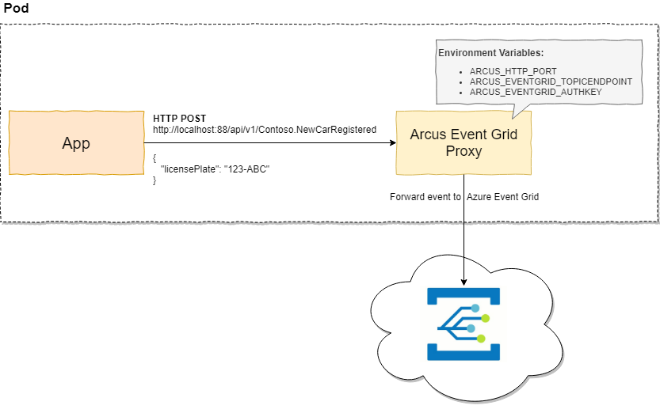

# Architecture
We provide a hosted REST API that allows you to POST events to which will be forwarded to an Azure Event Grid Topic of choice.

One of its main use cases is to run it as a sidecar next to your application but it can also be used as a standalone app in your infrastructure.
